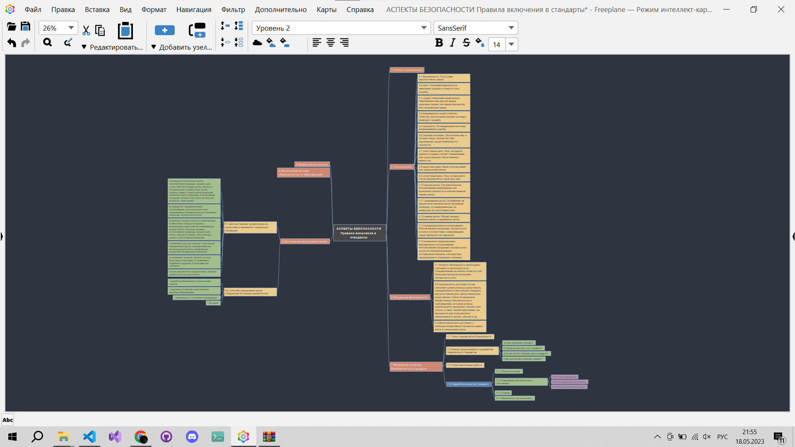

# Практическая работа № 5

## Цель работы

Изучить ГОСТ по защите информации и познакомиться с построением mind-карты

### Ход работы

1. Для построения mind-карты был взят ГОСТ Р 51898-2002. Защита информации. Основные термины и определения.

     Ссылка на документ - https://files.stroyinf.ru/Data2/1/4294845/4294845085.pdf

2. Была использована программа Freeplane

3. Результат

#### Оценка результата

Был изучен ГГОСТ Р 51898-2002. АСПЕКТЫ БЕЗОПАСНОСТИ Правила включения в стандарты. Основные термины и определения и была построена mind-карта в программе Xmind.

##### Вывод

Таким образам был изучет ГОСТ и познакомились с посторением mind-карт.